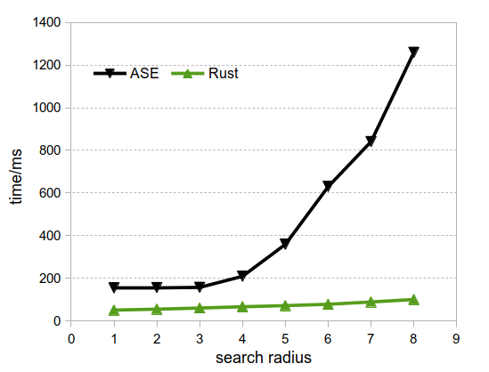

# Benchmarks

-   test system: Zeolite CLO, containing 4704 atoms.

# References

-   New linear-scaling neighbor list (21 March 2018): [Building neighbor-lists — ASE documentation](https://wiki.fysik.dtu.dk/ase/ase/neighborlist.html)

